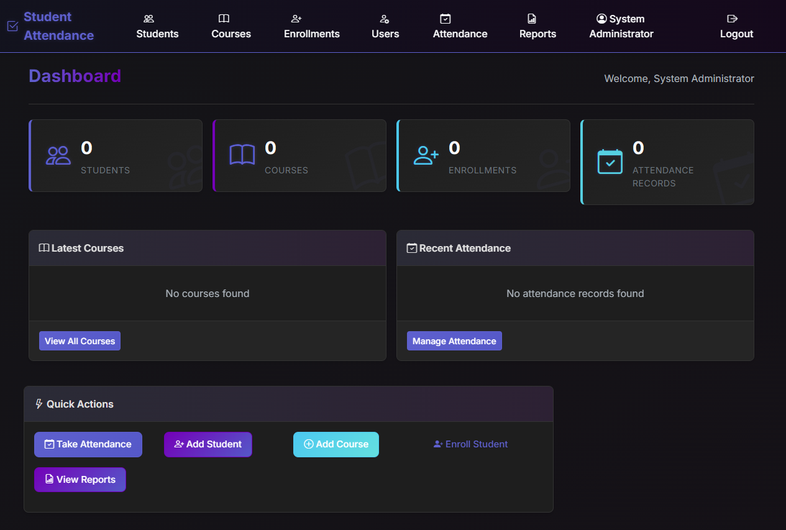
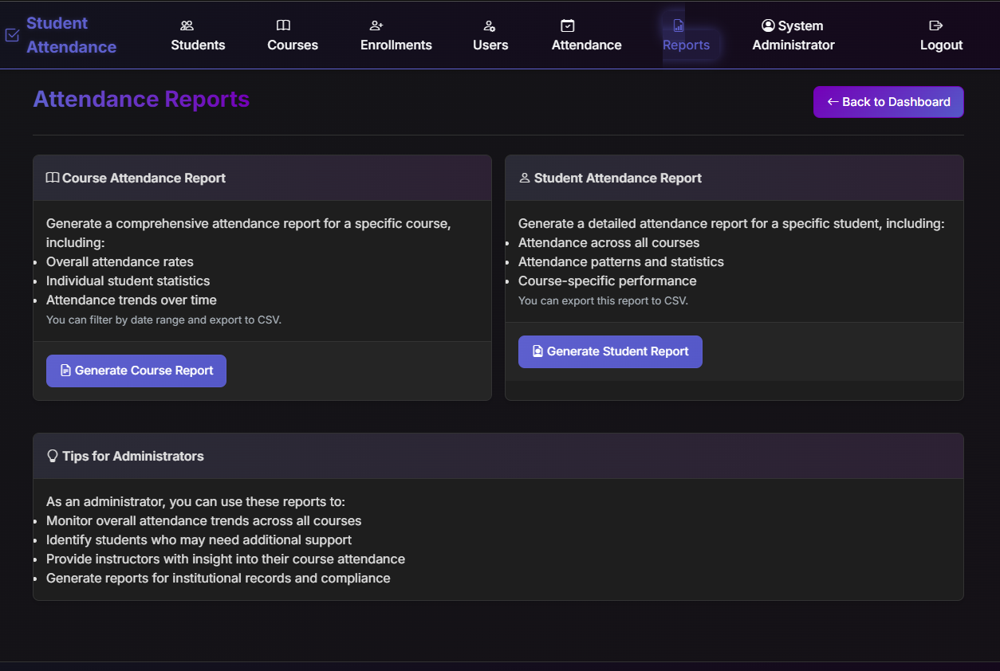

# Student Attendance System - Web Application

A modern, web-based student attendance tracking system built with Flask and SQLite.

## Features

- User authentication for admins and instructors
- Modern, responsive web interface
- Manage students, courses, and enrollments
- Take attendance by course with intuitive UI
- Generate visual attendance reports
- Export reports as CSV
- Role-based access control

## Screenshots





## System Requirements

- Python 3.6+
- SQLite3
- Required Python packages (see requirements.txt)

## Installation

1. Clone or download this repository
2. Install required packages:

```
pip install -r requirements.txt
```

## Setup

1. Run the application for the first time. The system will automatically create the database and a default admin user:

```
python webapp.py
```

2. Visit http://localhost:5000 in your browser
3. Login with the default admin credentials:
   - Username: `admin`
   - Password: `admin123`

4. Once logged in as admin, you can:
   - Add instructors via the User Management menu
   - Add students
   - Create courses
   - Enroll students in courses

## Usage Workflow

### For Administrators

1. **Manage Users**
   - Add instructors
   - View user list

2. **Manage Students**
   - Add/edit/delete students
   - View student list

3. **Manage Courses**
   - Add/edit/delete courses
   - Assign instructors to courses

4. **Manage Enrollments**
   - Enroll students in courses
   - Remove students from courses
   - View enrollments by course or student

5. **Take Attendance**
   - Record attendance for any course
   - View attendance records

6. **Generate Reports**
   - Course attendance summaries
   - Student attendance reports
   - Export as CSV

### For Instructors

1. **View Assigned Courses**
   - See course details
   - View enrolled students

2. **Take Attendance**
   - Record attendance for assigned courses
   - Mark students as present, absent, late, or excused

3. **View Attendance Records**
   - See past attendance records
   - Filter by date range

4. **Generate Reports**
   - Course attendance summaries
   - Student attendance reports for enrolled students

## Database Schema

The system uses the following database structure:

1. **users** - Administrators and instructors
   - id, username, password, full_name, role, created_at

2. **students** - Student records
   - id, student_id, full_name, email, phone, created_at

3. **courses** - Course information
   - id, course_code, course_name, instructor_id, description, created_at

4. **enrollments** - Links students to courses
   - id, student_id, course_id, enrollment_date

5. **attendance** - Attendance records
   - id, enrollment_id, date, status, notes, recorded_by, created_at

## Technology Stack

- **Backend**: Flask (Python)
- **Database**: SQLite
- **Authentication**: Flask-Login
- **Forms**: Flask-WTF
- **Frontend**: HTML, CSS, JavaScript
- **Security**: bcrypt password hashing, CSRF protection

## Customization

You can customize the application by:

1. Modifying the CSS in `static/css/main.css`
2. Adding new features by extending the Flask routes in `app.py`
3. Changing the database structure in `database.py`

## Security

- Passwords are hashed using bcrypt
- Forms are protected against CSRF attacks
- Role-based access control
- Input validation

## Software Engineering Artifacts

### Functional Requirements

1. Authentication
   - The system shall allow users to login with username and password
   - The system shall support two user roles: admin and instructor

2. Student Management
   - The system shall allow adding, editing, and viewing student records
   - Each student shall have a unique ID

3. Course Management
   - The system shall allow creating and managing courses
   - Each course shall be assigned to an instructor

4. Enrollment Management
   - The system shall allow enrolling students in courses
   - The system shall prevent duplicate enrollments

5. Attendance Tracking
   - The system shall allow recording attendance for students
   - The system shall support different attendance statuses (present, absent, late, excused)

6. Reporting
   - The system shall generate attendance reports by course
   - The system shall generate attendance reports by student
   - The system shall calculate attendance rates

### Non-Functional Requirements

1. Usability
   - The system shall provide a simple command-line interface
   - The system shall provide clear navigation between features

2. Performance
   - The system shall store data in a local SQLite database
   - The system shall operate without an internet connection

3. Security
   - The system shall securely hash all passwords
   - The system shall restrict access based on user roles

4. Maintainability
   - The system shall follow modular design principles
   - The system shall be organized into logical components

### Work Breakdown Structure (WBS)

1. Project Planning
   - Define requirements
   - Design database schema
   - Create project structure

2. Database Implementation
   - Create database schema
   - Implement database connection
   - Create default admin user

3. Authentication System
   - Implement user login/logout
   - Implement password hashing
   - Add role-based permissions

4. Admin Functions
   - Student management
   - Course management
   - Enrollment management
   - User management

5. Instructor Functions
   - Course view
   - Attendance recording
   - Viewing records

6. Reporting Functions
   - Course reports
   - Student reports
   - CSV export

7. User Interface
   - Main menu structure
   - Navigation flow
   - Form validation

8. Testing
   - Unit testing
   - Integration testing
   - User acceptance testing

9. Documentation
   - User manual
   - Installation instructions
   - Comments and docstrings

### Agile Methodology Suitability

Agile methodology is appropriate for this project because:

1. **Incremental Development** - The system can be built and deployed in phases (e.g., first authentication, then student management, then attendance, etc.)

2. **Changing Requirements** - Educational institutions often have evolving requirements for attendance tracking that may change during development

3. **Frequent Delivery** - Each module (authentication, student management, etc.) can be delivered and tested independently

4. **Simple Design** - The system follows a straightforward design focused on essential functionality

5. **User Feedback** - Instructors can provide feedback on early versions to improve usability

6. **Minimal Documentation** - The code is self-documenting with clear function names and comments

## License

This project is for educational purposes only. Feel free to modify and use as needed.

## Author

This Student Attendance System was created as a project demonstration. 
